<div align="center">


# Nexora — Enterprise ERP for Collegiate Institutions

**Open-Source · Anti-Mismatch Reconciliation Engine · Hackathon Edition — SMART VIThackathon(SVH)-2026**

*A full-stack, single-ledger ERP platform replacing disconnected spreadsheets, paper attendance registers, cash receipts, and isolated mark sheets with a unified relational system. Powered by an Anti-Mismatch Reconciliation Engine, it bridges the gap between academic, financial, and administrative data — with real-time BroadcastChannel sync, cryptographic hall-ticket gating, and a role-based three-panel command centre for 1,650+ students across four departments.*

<!-- Frontend -->
[](https://react.dev/)
[](https://www.typescriptlang.org/)
[](https://vitejs.dev/)
[](https://tailwindcss.com/)
<br />
<!-- Backend -->
[](https://nodejs.org/)
[](https://expressjs.com/)
[](https://mongodb.com)
[](https://redis.io)
<br />
<!-- Infrastructure -->
[](https://docker.com)
[](https://supabase.com)
[](https://jwt.io/)
[](https://developer.mozilla.org/en-US/docs/Web/API/BroadcastChannel)
<br />
[](./package.json)

</div>

---

## 📑 Table of Contents

| Icon | Section | Description | Link |
| :---: | :--- | :--- | :--- |
| 🎯 | **Hackathon Problem Statement** | PS-6 alignment and solution mapping table | [Go](#-hackathon-problem-statement--solution-mapping) |
| 📝 | **Executive Summary** | High-level overview — 3 core problems solved | [Go](#1-executive-summary) |
| 🏗️ | **System Architecture & Data Flow** | Backend architecture diagram + Mermaid layer breakdown | [Go](#2-system-architecture--data-flow) |
| 🏛️ | **Three-Panel ERP Architecture** | Admin · Faculty · Student · CoE command centres | [Go](#3-three-panel-erp-architecture) |
| ⚙️ | **Anti-Mismatch Reconciliation Engine** | Cross-module integrity validator + 5 discrepancy codes | [Go](#4-anti-mismatch-reconciliation-engine) |
| 💻 | **Technology Stack** | Frameworks, services, and infrastructure with badges | [Go](#5-technology-stack) |
| 🔄 | **Application Workflow** | End-to-end request pipeline and role-based routing | [Go](#6-application-workflow) |
| 🌊 | **Data Flow & State Management** | BroadcastChannel sync + unified ERP state schema | [Go](#7-data-flow--state-management) |
| 📁 | **Project Structure** | Annotated directory tree of the monorepo | [Go](#8-project-structure) |
| 🔌 | **API Reference** | All Express endpoints — Auth · Admin · Faculty · CoE | [Go](#9-api-reference) |
| ⚙️ | **Environment Configuration** | Required and optional environment variables | [Go](#10-environment-configuration) |
| 🚀 | **Installation & Local Setup** | Step-by-step guide with demo credentials | [Go](#11-installation--local-setup) |
| 🐳 | **Docker Deployment** | 4-service Compose stack with health checks | [Go](#12-docker-deployment) |
| 🔒 | **Security Considerations** | JWT, CORS, SHA-256 gating, audit trail | [Go](#13-security-considerations) |
| 📖 | **Feature Documentation** | All 20 core modules and capabilities | [Go](#14-feature-documentation) |
| 📈 | **Scalability & Future Improvements** | Current status and planned enhancements | [Go](#15-scalability--future-improvements) |
| 🤝 | **Contributing** | Team AC-DC members and contribution guidelines | [Go](#16-contributing) |
| 📜 | **License** | ISC open-source licensing terms | [Go](#17-license) |

---

## 📸 UI Showcase

> *Nexora ERP — live at **[nexora-frontend-five-tan.vercel.app](https://nexora-frontend-five-tan.vercel.app/)***.

<!-- Row 1 — Full-width: Landing Page Hero -->
<table width="100%">
  <tr>
    <td align="center">
      
      <br />
      <sub><b>🏠 Landing Page</b> — Public-facing marketing site with 3D Campus Tour, Architecture deep-dive, and Ledger Spec downloads</sub>
    </td>
  </tr>
</table>

<!-- Row 2 — 2-column: Admin Dual-View Mockup · Sign In / Auth -->
<table width="100%">
  <tr>
    <td width="50%" align="center">
      
      <br />
      <sub><b>📱 Admin Console — Mobile & Desktop</b> — Responsive dual-view of the Executive ERP Console with attendance heatmap, student growth chart, and financial overview</sub>
    </td>
    <td width="50%" align="center">
      
      <br />
      <sub><b>🔐 Sign In / Role Select</b> — Unified auth portal with role-based quick-access for Admin, Faculty, Student, CoE, and Parent — plus one-click Hackathon Evaluator Pass</sub>
    </td>
  </tr>
</table>

<!-- Row 3 — 2-column: Executive Admin Overview · Billing Management -->
<table width="100%">
  <tr>
    <td width="50%" align="center">
      
      <br />
      <sub><b>👑 Executive Admin Overview</b> — Full command centre: live broadcast feed, student growth analytics, department-wise attendance heatmap, and financial KPIs</sub>
    </td>
    <td width="50%" align="center">
      
      <br />
      <sub><b>💰 Billing Management</b> — Comprehensive fee ledger: ₹45.2L total revenue, 94.2% collection rate, student invoicing, teacher payroll, and Export CSV / Print Financial Ledger</sub>
    </td>
  </tr>
</table>

> 📂 **Add screenshots**: Save the 5 UI screenshots as `01-landing-page.png`, `02-admin-dashboard-mockup.png`, `03-sign-in-page.png`, `04-executive-admin-overview.png`, `05-billing-management.png` inside `Project Docs/screenshots/`.

---

## 🎯 Hackathon Problem Statement & Solution Mapping

> **Problem Track**: *PS-6 — ERP-Based Integrated Student Management System*
> **Mission**: Replace disconnected spreadsheets, paper attendance registers, cash collection receipts, and isolated mark sheets with a single, synchronized relational ERP ledger.

| Hackathon Requirement | Target Benchmark | Nexora ERP Implementation |
| :--- | :--- | :--- |
| **Admissions & Enrollment** | Unified student registry | **Single-source student master** with branch, section, programme, contact data; CSV bulk import; debarment flag propagation |
| **Attendance Management** | Digital attendance with threshold alerts | **Faculty daily roster submission**, 75% threshold auto-debarment, Admin real-time feed, subject-wise breakdown |
| **Fee Management** | Digital fee collection and tracking | **Invoicing, receipt generation, pending ledger**, due-date tracking, collection-rate KPIs, CSV export |
| **Examination & Results** | Hall-ticket gating and result publishing | **Cryptographic SHA-256 hall-ticket tokens**, CoE controller workflow, admit-card gating at 75% + fee-cleared |
| **Anti-Mismatch Reconciliation** | Zero manual reconciliation | **Anti-Mismatch Engine** cross-validates Admissions ↔ Attendance ↔ Fees ↔ Exams; 0-discrepancy audit ledger as CSV |
| **Role-Based Access** | Admin / Faculty / Student separation | **Three distinct dashboards** with JWT-authenticated role routing; CoE, Finance, Library sub-roles |

---

## 📝 1. Executive Summary

Nexora is an open-source, production-grade **collegiate ERP platform** built for SMART VIThackathon(SVH)-2026, solving PS-6. It deploys a unified relational state layer — persisted via Supabase PostgreSQL and mirrored in a local offline cache — synchronized across all browser tabs via a zero-latency **BroadcastChannel event bus**.

**The platform solves three critical institutional data failures:**

1. **Attendance-Fee Mismatch**: A student clears fees but the attendance register is not updated. Nexora's Anti-Mismatch Engine cross-validates both, raises automated discrepancies, and blocks hall-ticket issuance until cleared.

2. **Hall Ticket Gating Failure**: Students receive exam admit cards despite failing attendance or having pending fees. Nexora implements a **cryptographic SHA-256 gating layer** — every hall ticket is a signed token verifiable by the invigilator.

3. **No Single Source of Truth**: Marks in Excel, attendance in paper registers, fees in Tally — three systems, three versions of reality. Nexora provides a **single relational ledger** where every entity links back to a student master record.

The platform delivers:
- Real-time 0-discrepancy institutional audit across all modules
- Role-based three-panel command centres (Admin / Faculty / Student / CoE)
- Cryptographic hall-ticket generation with QR scanning
- Fee invoicing, receipt generation, and pending ledger
- Subject-wise attendance with department-level heatmaps and radar charts
- CoE examination workflow (seating plans, invigilators, results publishing)
- Watermarked PDF export engine for all institutional reports
- Three.js WebGL global animated background with pastel shredder column system

---

## 🏗️ 2. System Architecture & Data Flow

### 🏛️ Backend Architecture Diagram


*Multi-layer architecture: Client Panels (Teacher · Admin · Student) → Express.js Server (Middleware Layer: Auth JWT · Validation · Logging · Rate Limiting · Error Handling) → Controller Layer (Admin Ctrl · Teacher Ctrl · Student Ctrl · Shared Ctrl · CoE Ctrl · Media Ctrl · Blog Ctrl · Billing Ctrl) → Service Layer → Database Layer (MongoDB + Redis + Email SMTP) → External Services (OpenAI · Stripe).*

### 🔹 Layer Breakdown

```mermaid
flowchart TD
    classDef panel fill:#1C1000,stroke:#D97706,stroke-width:2px,color:#FFFFFF
    classDef middleware fill:#0C1825,stroke:#0891B2,stroke-width:2px,color:#FFFFFF
    classDef controller fill:#0C1525,stroke:#1D4ED8,stroke-width:2px,color:#FFFFFF
    classDef db fill:#052e16,stroke:#22c55e,stroke-width:2px,color:#FFFFFF
    classDef ext fill:#450a0a,stroke:#ef4444,stroke-width:2px,color:#FFFFFF

    subgraph Panels["📱 CLIENT PANELS"]
        direction LR
        TEACHER["👨‍🏫 Teacher Panel"]:::panel
        ADMIN["👑 Admin Panel"]:::panel
        STUDENT["🎓 Student Panel"]:::panel
        CLIENT["Mobile · Desktop · Web"]:::panel
    end

    subgraph Server["⚙️ EXPRESS.JS SERVER"]
        direction TB
        subgraph MW["🛡️ MIDDLEWARE LAYER"]
            direction LR
            A1["Auth JWT"]:::middleware
            A2["Validation"]:::middleware
            A3["Logging"]:::middleware
            A4["Rate Limiting"]:::middleware
            A5["Error Handling"]:::middleware
        end
        subgraph CTRL["🎮 CONTROLLER LAYER"]
            direction LR
            C1["Admin Ctrl"]:::controller
            C2["Teacher Ctrl"]:::controller
            C3["Student Ctrl"]:::controller
            C4["CoE Ctrl"]:::controller
            C5["Billing Ctrl"]:::controller
            C6["Media Ctrl"]:::controller
        end
    end

    subgraph DB["💾 DATABASE LAYER"]
        direction LR
        MONGO[("🍃 MongoDB\nStudents · Courses · Attendance\nGrades · Billing · Exams")]:::db
        REDIS[("⚡ Redis\nSession Cache")]:::db
        SMTP["📧 Email SMTP\nNotifications"]:::db
    end

    subgraph EXT["🌐 EXTERNAL SERVICES"]
        direction LR
        OPENAI["🤖 OpenAI\nAI Copilot"]:::ext
        STRIPE["💳 Stripe\nPayments"]:::ext
    end

    Panels -->|"HTTP + Bearer JWT"| MW
    MW --> CTRL
    CTRL --> DB
    DB --> EXT
```



---

## 🏛️ 3. Three-Panel ERP Architecture

Nexora renders three independent, role-gated command centres inside the same **AppLayout** shell: collapsible left navigation, central data feed/analytics grid, and right-side alert panel.

### 👑 3.1 Admin Executive Dashboard

| Section | Capability |
| :--- | :--- |
| **KPI Command Strip** | Total Students · Total Faculty · Today's Attendance · Fee Collections |
| **Student Growth Chart** | Annotated line chart with labeled bubble callouts and target reference line |
| **Weekly Attendance Heatmap** | Dept × Day color-intensity grid — blue ≥90%, teal 80–89%, amber 75–79%, coral <75% |
| **Attendance Radar Chart** | Mon–Sat spider/radar chart: Present / Absent / Late weekly pattern |
| **Financial Overview** | Tabbed bar chart with gradient fills: Total Earned / Total Due / Expenses |
| **Anti-Mismatch Audit Ledger** | Cross-module reconciliation table; Re-Run Audit · Export CSV |
| **Department Performance Table** | HOD · Students · Avg Attendance · Fee Rate · Status pills per branch |
| **Attention Alerts Sidebar** | Unpaid fees · Debarment triggers · Pending attendance · Hall-ticket queue |

### 👨‍🏫 3.2 Faculty Dashboard

| Section | Capability |
| :--- | :--- |
| **Daily Attendance Roster** | One-click present / absent / late marking with BroadcastChannel publish |
| **Subject-Wise Overview** | Attendance % per subject across sections |
| **Grade Entry** | Marks submission per subject, moderation log |
| **Faculty Digital ID** | QR-coded faculty ID card with role badge; PDF download |
| **Timetable View** | Weekly lecture schedule grid |

### 🎓 3.3 Student Dashboard

| Section | Capability |
| :--- | :--- |
| **Attendance Tracker** | Subject-wise attendance % with 75% threshold progress bars |
| **Fee Statement** | Invoices, receipts, pending balance, semester breakdown |
| **Hall Ticket** | Cryptographic admit card (SHA-256 signed token) — gated by attendance + fee clearance |
| **Exam Results** | Published marks per subject, SGPA / CGPA calculation |
| **Student Digital ID** | QR-coded ID card with course, branch, and validity |
| **Debarred Status** | Red alert banner if attendance < 75% with resolution path |

### 🔐 3.4 Examination Controller (CoE)

| Section | Capability |
| :--- | :--- |
| **Seating Arrangement** | Room-wise student allocation with auto-generation |
| **Invigilator Assignment** | Faculty-to-room mapping with conflict detection |
| **Hall-Ticket Gatekeeper** | Batch approve / reject with cryptographic SHA-256 token issuance |
| **Malpractice Registry** | Incident logging with student, subject, invigilator |
| **Result Publishing** | Subject-wise marks release, SGPA computation, bulk CSV upload |
| **Revaluation Requests** | Student-initiated revaluation workflow |

---

## ⚙️ 4. Anti-Mismatch Reconciliation Engine

The core innovation of Nexora ERP is its **Anti-Mismatch Engine** — a cross-module integrity validator that replaces manual end-of-semester reconciliation work entirely.

```
Student Master Record (Admissions)  ─┐
Attendance Ledger (Faculty Roster)   ─┤──▶ Anti-Mismatch Engine ──▶ Discrepancy?
Fee Invoices (Accounts)              ─┤                                │
Exam Eligibility (CoE)              ─┘                     YES ──▶ Raise + Suggest Fix
                                                            NO  ──▶ ✅ RECONCILED
                                                                     │
                                                                     ▼
                                                        Issue Cryptographic Hall Ticket
```

### 🔍 Discrepancy Categories

| Code | Domain | Problem Detected | Automated Resolution |
| :--- | :--- | :--- | :--- |
| `ATT-MISMATCH-001` | Attendance | Faculty roster ≠ student attendance % in system | Re-sync from BroadcastChannel event; flag for HOD review |
| `FEE-PENDING-002` | Finance | Student active in admissions but fee invoice unpaid | Block hall-ticket issuance; send email reminder |
| `EXAM-GATE-003` | Examination | Hall ticket requested but attendance < 75% | Reject token; generate condonation form link |
| `ADMIT-ORPHAN-004` | Admissions | Fee record exists with no matching student master | Flag as ghost record; prompt admin verification |
| `MARKS-MISSING-005` | Results | Exam conducted; marks not submitted by faculty | Escalate to CoE; lock result publish pipeline |

---

## 💻 5. Technology Stack

### 🖥️ 5.1 Frontend

[](https://react.dev/)
[](https://www.typescriptlang.org/)
[](https://vitejs.dev/)
[](https://tailwindcss.com/)
[](https://ui.shadcn.com/)
[](https://recharts.org/)
[](https://threejs.org/)
[](https://reactrouter.com/)
[](https://lucide.dev/)

| Technology | Version | Purpose |
| :--- | :--- | :--- |
| **React** | 18.x | UI component model, hooks, context providers |
| **TypeScript** | 5.x | Type safety across the entire frontend codebase |
| **Vite** | 5.4 | Ultra-fast bundler, HMR dev server |
| **Tailwind CSS** | 3.x | Utility-first styling, design tokens, responsive layout |
| **shadcn/ui** | latest | Accessible, composable component primitives |
| **Recharts** | 2.x | RadarChart, LineChart, BarChart, AreaChart for ERP analytics |
| **Three.js** | r128–r160 | `ExpanseBackground` — global persistent WebGL shader |
| **React Router** | 6.x | Client-side routing with role-based protected routes |
| **Lucide React** | latest | Consistent ERP iconography |
| **clsx / tailwind-merge** | latest | Conditional class composition |

### ⚙️ 5.2 Backend

[](https://nodejs.org/)
[](https://expressjs.com/)
[](https://mongoosejs.com/)
[](https://jwt.io/)
[](https://github.com/dcodeIO/bcrypt.js)
[](https://helmetjs.github.io/)
[](https://nodemon.io/)

| Technology | Version | Purpose |
| :--- | :--- | :--- |
| **Node.js** | 20.x | JavaScript runtime for the Express server |
| **Express.js** | 4.18 | REST API framework, middleware stack, route controllers |
| **Mongoose** | 7.x | MongoDB ODM for schema validation and querying |
| **jsonwebtoken** | 9.x | JWT Bearer token issuance and verification |
| **bcryptjs** | 2.x | Password hashing for user credentials |
| **Helmet** | 7.x | HTTP security headers |
| **Morgan** | 1.x | HTTP request logging |
| **CORS** | 2.x | Cross-Origin Resource Sharing |
| **dotenv** | 16.x | Environment variable management |
| **nodemon** | 3.x | Development hot-reload |

### 🗄️ 5.3 Data & Storage

[](https://mongodb.com)
[](https://redis.io)
[](https://supabase.com)
[](https://developer.mozilla.org/en-US/docs/Web/API/BroadcastChannel)

| Technology | Role |
| :--- | :--- |
| **MongoDB 7** | Primary document store — Students, Courses, Attendance, Fees, Exams |
| **Redis 7** | Session cache, BroadcastChannel bridge, rate-limiting store |
| **Supabase** | PostgreSQL auth and structured data (optional cloud sync) |
| **localStorage / JSON** | Offline-first ERP state cache (`nexora-unified-erp-v1`) |
| **BroadcastChannel API** | Zero-latency cross-tab state synchronization (0 ms) |

### 🏗️ 5.4 Infrastructure & DevOps

| Component | Technology | Responsibility |
| :--- | :--- | :--- |
| **frontend/Dockerfile** | Node 20 Alpine → Nginx 1.25 Alpine | Vite build, SPA routing, `/api/*` reverse proxy |
| **backend/Dockerfile** | Node 20 Alpine | Express API, non-root `nexora` user, health check |
| **MongoDB Container** | mongo:7.0-jammy | ERP document store with named volume persistence |
| **Redis Container** | redis:7.2-alpine | Session + event cache, 256 MB LRU eviction |
| **docker-compose.yml** | Compose v3.9 | Full stack with health-check dependency ordering |

### 🔗 5.5 Third-Party Services

| Provider | Category | Usage |
| :--- | :--- | :--- |
| **Supabase** | Auth + PostgreSQL | User authentication, optional cloud persistence |
| **Vercel** | Hosting | Frontend deployment (`vercel.json`) |
| **OpenAI** | AI Copilot | AI-assisted ERP insights (configured) |
| **Stripe** | Payments | Fee payment processing gateway (configured) |

---

## 🔄 6. Application Workflow

### 🛤️ End-to-End Request Pipeline

```
User (Admin / Faculty / Student)
        │
        ▼  HTTP + Bearer JWT
Middleware Layer
  ├── JWT Verify → extract role + user ID
  ├── Rate Limiter (per-IP + per-route)
  └── Input Validation
        │
        ▼  if authorised
Role Controller
  (Admin Ctrl / Teacher Ctrl / Student Ctrl / CoE Ctrl)
        │
        ▼
Service Layer (Business Logic + Anti-Mismatch checks)
        │
        ▼
MongoDB (Mongoose) ←→ Redis (cache lookup / write-through)
        │
        ▼  JSON response
React Frontend → re-render dashboard panel
        │
        ▼
BroadcastChannel.postMessage('nexora_erp_bus')
        │
        ▼
All open browser tabs sync instantly (0 ms latency)
```

### 🏷️ Role-Based Route Mapping

| Role | Route Prefix | JWT Claim | Access Scope |
| :--- | :--- | :--- | :--- |
| `admin` | `/admin/*` | `role: admin` | All modules, audit ledger, user management |
| `teacher` | `/teacher/*` | `role: teacher` | Attendance roster, grade entry, timetable |
| `student` | `/student/*` | `role: student` | Own records, fee statement, hall ticket |
| `coe` | `/examination-controller/*` | `role: coe` | Seating, hall-ticket gating, results |
| `finance` | `/admin/billing` | `role: finance` | Fee invoices, payment tracking |

---

## 🌊 7. Data Flow & State Management

```
Login (AuthContext)
    │ JWT issued
    ▼
localStorage  ──────────────────────────────────────▶  BroadcastChannel (nexora_erp_bus)
(nexora-unified-erp-v1)                                       │
    │                                                          ▼
    │                                               All open tabs sync (0 ms)
    ▼
Express API (/api/**)
    ├──▶ MongoDB  (read / write documents)
    └──▶ Redis    (session cache / invalidation)
          │
          ▼
    React State (hooks + context) → UI re-render
```

### 💾 Unified ERP State Schema

| Field | Type | Description |
| :--- | :--- | :--- |
| `students` | `Student[]` | Master registry — all enrolled students |
| `courses` | `Course[]` | Subject catalogue with branch and faculty mapping |
| `attendance` | `AttendanceRecord[]` | Daily roster, subject-wise, faculty-submitted |
| `fees` | `FeeInvoice[]` | Semester invoices with receipt and status |
| `exams` | `ExamRecord[]` | Hall tickets, seating plans, malpractice, results |
| `teachers` | `Teacher[]` | Faculty registry with department and subjects |
| `stats` | `SystemStats` | Aggregated KPIs — debarred count, collection rate |

---

## 📁 8. Project Structure

```
Nexora/
├── Dockerfile                        ← Root multi-stage (single-container fallback)
├── docker-compose.yml                ← Full stack: frontend + backend + MongoDB + Redis
├── docker-compose.dev.yml            ← Dev override: Vite HMR + nodemon hot-reload
├── .dockerignore
├── db.sql                            ← PostgreSQL schema (Supabase reference)
├── package.json                      ← Monorepo root (npm workspaces)
│
├── frontend/                         ← React 18 + Vite Application
│   ├── Dockerfile                    ← Node 20 → Nginx multi-stage build
│   ├── nginx.conf                    ← SPA routing + /api/* reverse proxy
│   └── src/
│       ├── App.tsx                   ← Root router with role-based protected routes
│       ├── pages/
│       │   ├── AdminOverview.tsx     ← Executive admin dashboard (KPIs, charts, audit)
│       │   ├── ManageStudents.tsx    ← Student master registry + bulk import
│       │   ├── TeacherDashboard.tsx  ← Faculty attendance + grade entry
│       │   ├── StudentDashboard.tsx  ← Student portal (attendance, fees, hall ticket)
│       │   ├── BillingPage.tsx       ← Fee invoicing and payment tracking
│       │   ├── ExamController.tsx    ← CoE workflow (seating, gating, results)
│       │   └── Auth.tsx              ← Login with role-demo shortcuts
│       ├── components/
│       │   ├── layout/
│       │   │   ├── AppLayout.tsx          ← Shell: sidebar + main feed + right panel
│       │   │   ├── SidebarNavigation.tsx  ← Role-aware collapsible sidebar
│       │   │   └── navigationData.ts      ← Role-based nav item definitions
│       │   ├── background/
│       │   │   └── ExpanseBackground.tsx  ← Three.js persistent WebGL shader
│       │   └── ui/                        ← shadcn/ui component library
│       ├── contexts/
│       │   └── AuthContext.tsx       ← JWT auth state provider
│       ├── hooks/
│       │   ├── useERPData.ts         ← Unified ERP state + BroadcastChannel sync
│       │   ├── useAdminData.ts       ← Admin-specific hooks (branches, stats)
│       │   ├── useAdminIDData.ts     ← Admin ID card data
│       │   ├── useStudentIDData.ts   ← Student ID card data
│       │   └── useTeacherIDData.ts   ← Faculty ID card data
│       ├── services/
│       │   ├── coeService.ts         ← CoE localStorage service layer
│       │   └── meetService.ts        ← Google Meet integration bus
│       └── lib/
│           └── supabase.ts           ← Supabase client + offline fallback
│
├── backend/                          ← Express.js API Server
│   ├── Dockerfile                    ← Node 20 Alpine, non-root user
│   ├── src/
│   │   └── server.js                 ← Express entrypoint (all routes + middleware)
│   └── data/
│       └── erp_state.json            ← Seeded ERP demo state (1,650+ students)
│
├── Project Docs/
│   └── CampusSync Backend Architecture.png  ← Official system architecture diagram
│
└── supabase/                          ← Supabase migrations and config
```

---

## 🔌 9. API Reference

All endpoints served at `http://localhost:5000/api`.

### 🔐 Authentication

| Method | Endpoint | Description |
| :--- | :--- | :--- |
| `POST` | `/api/auth/login` | Role-based login; returns JWT Bearer token |
| `POST` | `/api/auth/logout` | Invalidate session, clear Redis entry |
| `GET` | `/api/auth/me` | Return current authenticated user from JWT |

### 👑 Admin

| Method | Endpoint | Description |
| :--- | :--- | :--- |
| `GET` | `/api/admin/students` | Paginated student master registry |
| `POST` | `/api/admin/students` | Create / bulk-import students |
| `PUT` | `/api/admin/students/:id` | Update student record |
| `DELETE` | `/api/admin/students/:id` | Soft-delete student |
| `GET` | `/api/admin/stats` | System KPIs — debarred count, collection rate |
| `GET` | `/api/admin/audit` | Run Anti-Mismatch reconciliation; return discrepancies |
| `GET` | `/api/admin/audit/export` | Download audit ledger as CSV |

### 👨‍🏫 Faculty

| Method | Endpoint | Description |
| :--- | :--- | :--- |
| `GET` | `/api/teacher/attendance` | Today's roster for teacher's subjects |
| `POST` | `/api/teacher/attendance` | Submit attendance roster (triggers BroadcastChannel sync) |
| `GET` | `/api/teacher/grades` | Grade entry sheet for assigned subjects |
| `POST` | `/api/teacher/grades` | Submit student marks |

### 🎓 Student

| Method | Endpoint | Description |
| :--- | :--- | :--- |
| `GET` | `/api/student/:id/attendance` | Subject-wise attendance percentage |
| `GET` | `/api/student/:id/fees` | Fee invoices and payment history |
| `GET` | `/api/student/:id/hall-ticket` | Cryptographic hall-ticket token (gated) |
| `GET` | `/api/student/:id/results` | Published exam results and SGPA |

### 🔐 Examination Controller (CoE)

| Method | Endpoint | Description |
| :--- | :--- | :--- |
| `POST` | `/api/coe/hall-tickets/approve` | Batch approve + issue SHA-256 tokens |
| `POST` | `/api/coe/seating` | Generate seating arrangement |
| `POST` | `/api/coe/results/publish` | Publish results for a subject |
| `POST` | `/api/coe/malpractice` | Log malpractice incident |
| `POST` | `/api/coe/revaluation` | Process revaluation request |

### 💰 Finance

| Method | Endpoint | Description |
| :--- | :--- | :--- |
| `GET` | `/api/billing/invoices` | All fee invoices with status |
| `POST` | `/api/billing/pay` | Mark payment received + generate receipt |
| `GET` | `/api/billing/export` | Download fee ledger as CSV |

---

## ⚙️ 10. Environment Configuration

Copy `backend/.env.example` to `backend/.env`. The platform runs fully offline without any third-party keys — Supabase, OpenAI, and Stripe are all optional.

| Category | Variable | Required | Purpose |
| :--- | :--- | :--- | :--- |
| **Server** | `PORT` | ✅ Yes | Express port (default: `5000`) |
| **Server** | `NODE_ENV` | ✅ Yes | `development` or `production` |
| **JWT** | `JWT_SECRET` | ✅ Yes | Secret for signing Bearer tokens |
| **MongoDB** | `MONGODB_URI` | Optional | MongoDB connection string |
| **Redis** | `REDIS_URL` | Optional | Redis connection string |
| **Supabase** | `SUPABASE_URL` | Optional | Supabase project URL |
| **Supabase** | `SUPABASE_ANON_KEY` | Optional | Supabase anonymous public key |
| **OpenAI** | `OPENAI_API_KEY` | Optional | AI Copilot features |
| **Stripe** | `STRIPE_SECRET_KEY` | Optional | Payment processing |

---

## 🚀 11. Installation & Local Setup

### ✅ Prerequisites

| Tool | Version | Purpose |
| :--- | :--- | :--- |
| Node.js | ≥20.x | Frontend + Backend runtime |
| npm | ≥9.x | Package management (monorepo workspaces) |
| Docker + Compose | Latest | Containerized deployment |
| Git | ≥2.40 | Repository cloning |

### ⚡ Quick Start

```bash
# 1. Clone the repository
git clone https://github.com/KrishnaNsingh/Nexora.git
cd Nexora

# 2. Install all dependencies (monorepo — installs frontend + backend)
npm install

# 3. Configure environment
cp backend/.env.example backend/.env
# Open backend/.env and set JWT_SECRET at minimum

# 4. Start both servers concurrently
npm run dev
# → Frontend: http://localhost:5173  (Vite HMR)
# → Backend:  http://localhost:5000  (Express API)
```

### Alternative: Start separately

```bash
# Backend only
npm run dev:backend

# Frontend only
npm run dev:frontend

# Build for production
npm run build:frontend
npm run build:backend
```

### 🔑 Demo Credentials

| Role | Email | Notes |
| :--- | :--- | :--- |
| Admin (Dean) | `admin@nexora.edu` | Full access — audit, manage, billing |
| Faculty | `sarah.johnson@college.edu` | Attendance + grade entry |
| Student | `demo@university.edu` | Own records, fees, hall ticket |
| CoE Controller | `coe@nexora.edu` | Seating, gating, result publishing |

> Use the role-switcher shortcuts on the login page for instant demo access.

---

## 🐳 12. Docker Deployment

### File Layout

```
Nexora/
├── Dockerfile                 ← Single-container full-stack (alternative)
├── docker-compose.yml         ← Multi-service (recommended for production)
├── docker-compose.dev.yml     ← Dev override (HMR + nodemon + debug ports)
├── frontend/
│   ├── Dockerfile             ← Stage 1: Vite build → Stage 2: Nginx serve
│   └── nginx.conf             ← SPA routing + /api/* proxy to backend
└── backend/
    └── Dockerfile             ← Node 20 Alpine, non-root user
```

### 🐳 Full Stack — Production

```bash
# Build all images and start all services
docker compose up --build

# Detached (background) mode
docker compose up -d

# Follow logs
docker compose logs -f frontend
docker compose logs -f backend

# Stop and remove containers
docker compose down
```

| Service | Image | Port | Health Check |
| :--- | :--- | :--- | :--- |
| `frontend` | Node 20 Alpine → Nginx 1.25 | `3000` | `wget http://localhost:80` |
| `backend` | Node 20 Alpine | `5000` | `wget http://localhost:5000/api/health` |
| `mongo` | mongo:7.0-jammy | `27017` | `mongosh --eval db.ping()` |
| `redis` | redis:7.2-alpine | `6379` | `redis-cli ping` |

### 🛠️ Development Override

```bash
# Hot-reload: Vite HMR for frontend + nodemon for backend
# Exposes port 9229 (Node.js inspector) and DB ports for GUI tools
docker compose -f docker-compose.yml -f docker-compose.dev.yml up
```

---

## 🔒 13. Security Considerations

| Area | Implementation | Status |
| :--- | :--- | :--- |
| **JWT Authentication** | Bearer token on all protected routes via `jsonwebtoken` | ✅ |
| **Role-Based Access** | Controller-level role guard before any data access | ✅ |
| **HTTP Security Headers** | `helmet` middleware on all Express routes | ✅ |
| **CORS Policy** | Allowlist-based origin control in Express | ✅ |
| **Non-Root Container** | Backend Docker image runs as `nexora` (UID non-root) | ✅ |
| **Cryptographic Hall Tickets** | SHA-256 signed token — tamper-evident admit card | ✅ |
| **Rate Limiting** | Per-route and per-IP rate limiter middleware | ✅ |
| **Password Hashing** | `bcryptjs` with salt rounds for user credentials | ✅ |
| **Environment Secrets** | All via `.env` — no hardcoded credentials in source | ✅ |
| **Audit Trail** | Every Anti-Mismatch run logged with timestamp and actor | ✅ |

---

## 📖 14. Feature Documentation

| Module | Feature | Key Technology |
| :--- | :--- | :--- |
| **Admin Dashboard** | Executive KPI strip — 4 real-time metrics | React, Recharts |
| **Attendance Heatmap** | Dept × Day color-intensity grid (blue/teal/amber/coral) | CSS grid, JS |
| **Attendance Radar Chart** | Mon–Sat spider chart: Present / Absent / Late | Recharts RadarChart |
| **Student Growth Chart** | Annotated line chart with bubble callout labels | Recharts LineChart |
| **Financial Bar Chart** | Tabbed: Earned / Due / Expenses with gradient fills | Recharts BarChart |
| **Anti-Mismatch Ledger** | Cross-module reconciliation + CSV export | React, Express |
| **Department Table** | HOD · Students · Avg Attendance · Fee Rate · Status | React, Tailwind |
| **Attendance Roster** | Faculty daily submit + BroadcastChannel 0 ms sync | BroadcastChannel API |
| **Fee Invoicing** | Invoice generation, payment tracking, receipts | Express, MongoDB |
| **Hall-Ticket Gating** | SHA-256 cryptographic admit card with QR code | crypto, QRCode |
| **CoE Seating Planner** | Room-wise auto-allocation with conflict detection | React, coeService |
| **Result Publisher** | Marks entry, SGPA calc, bulk CSV publish | Express, Mongoose |
| **Digital ID Cards** | QR-coded ID for Admin / Faculty / Student roles | React |
| **WebGL Background** | `ExpanseBackground` — Three.js persistent shader | Three.js r128–r160 |
| **Shredder Columns** | 14-bar pastel vertical-band gradient on all cards/panels | CSS linear-gradient |
| **PDF Export** | Watermarked institutional reports for all modules | jsPDF / html2canvas |
| **BroadcastChannel Sync** | 0 ms cross-tab state update on any data mutation | BroadcastChannel API |
| **CSV Bulk Import** | Student master batch upload via spreadsheet | papaparse |
| **Dark / Light Theme** | System-aware with Tailwind CSS variables | ThemeProvider |
| **Debarment Engine** | Auto-flag students < 75% attendance; block hall ticket | Express, Mongoose |

---

## 📈 15. Scalability & Future Improvements

### ✅ Currently Implemented
- Three-panel role-based ERP (Admin / Faculty / Student / CoE)
- Anti-Mismatch Reconciliation Engine with 0-discrepancy audit
- Docker Compose full-stack — 4 services with health-check dependency ordering
- BroadcastChannel 0 ms cross-tab state synchronization
- Cryptographic SHA-256 hall-ticket token system
- Offline-first JSON cache with optional Supabase cloud sync
- Award-winning analytics: Radar Chart · Heatmap · Annotated Line Chart · Financial Tabs
- Three.js WebGL global animated background

### 🚀 Planned Future Improvements

| Area | Improvement | Complexity |
| :--- | :--- | :--- |
| **AI / ML** | AI-powered attendance anomaly detection (LSTM) | High |
| **Notifications** | Email / SMS alerts for debarment and fee due-dates | Medium |
| **Mobile App** | React Native companion for faculty attendance submission | High |
| **CI/CD** | GitHub Actions — automated tests + Docker build + deploy | Medium |
| **Blockchain** | NFT-based degree certificates on Ethereum Sepolia | High |
| **Kubernetes** | K8s manifests with HPA auto-scaling for production | Medium |
| **Multi-Institution** | SaaS multi-tenant mode for college consortium | High |
| **Voice Commands** | AI voice assistant for faculty attendance marking | Medium |
| **Analytics** | Advanced cohort retention and pivot-table reporting | Medium |
| **ABHA Integration** | ABDM health linkage for institutional health records | High |

---

## 🤝 16. Contributing

Nexora ERP was built by **Team AC-DC** for Origin Hackathon-2026. We welcome contributions from developers, educators, and institutional technology researchers.

### 👥 Core Team — AC-DC

[](https://github.com/Mausam5055/Nexora/graphs/contributors)

<table>
  <tr>
    <td align="center">
      <a href="https://github.com/Mausam5055">
        <br />
        <sub><b>Mausam Kar</b></sub>
      </a><br />
      <a href="https://github.com/Mausam5055">@Mausam5055</a>
    </td>
    <td align="center">
      <a href="https://github.com/KrishnaNsingh">
        <br />
        <sub><b>Krishna Narayan Singh</b></sub>
      </a><br />
      <a href="https://github.com/KrishnaNsingh">@KrishnaNsingh</a>
    </td>
    <td align="center">
      <a href="https://github.com/ShaikhWarsi">
        <br />
        <sub><b>ShaikhWarsi</b></sub>
      </a><br />
      <a href="https://github.com/ShaikhWarsi">@ShaikhWarsi</a>
    </td>
    <td align="center">
      <a href="https://github.com/Rachit-Tiwari-7">
        <br />
        <sub><b>Rachit Tiwari</b></sub>
      </a><br />
      <a href="https://github.com/Rachit-Tiwari-7">@Rachit-Tiwari-7</a>
    </td>
  </tr>
</table>

### 📝 Contribution Workflow

1. **Understand the architecture**: Read [System Architecture](#2-system-architecture--data-flow) and [Three-Panel ERP](#3-three-panel-erp-architecture) sections first.

2. **Fork and branch**:
   ```bash
   git checkout -b feature/your-feature-name
   ```

3. **Follow project conventions**:
   - **Backend routes**: Add to `backend/src/server.js` with a role middleware guard before any handler.
   - **Frontend components**: TypeScript strict mode, Tailwind utilities, semantic pastel palette tokens from `src/index.css`.
   - **New ERP modules**: Expose state through `useERPData.ts` and broadcast all mutations via `BroadcastChannel`.

4. **Test your changes**:
   ```bash
   cd backend && npm test
   cd frontend && npm run build
   ```

5. **Open a pull request** with description, motivation, and screenshots for any UI changes.

---

## 📜 17. License

Licensed under **ISC**.

Submitted for **Origin Hackathon-2026**. For usage beyond hackathon evaluation, please open an issue to discuss licensing terms with the maintainers.

---

<div align="center">

---

### 🔹 Built with ❤️ by Team **AC-DC** (Nexora) for Origin Hackathon-2026

[](https://github.com/Mausam5055)
[](https://github.com/KrishnaNsingh)
[](https://github.com/ShaikhWarsi)
[](https://github.com/Rachit-Tiwari-7)

*Nexora ERP — One Ledger. Zero Mismatches. Total Control.*

*Anti-Mismatch Engine · Cryptographic Hall Tickets · Real-Time BroadcastChannel Sync · Docker-Deployed*

</div>
